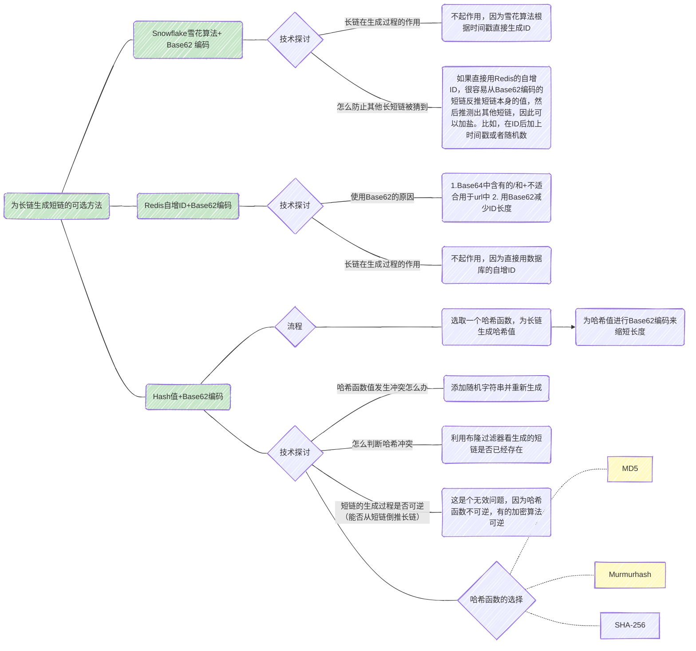

```mermaid
---
config:
  theme: default
  look: handDrawn
  layout: dagre
---
flowchart LR
    A("为长链生成短链的可选方法") --- A1("Redis自增ID+Base62编码") & A2("Hash值+Base62编码") & A3("Snowflake雪花算法+ Base62 编码")
    A3 --- A3Tech{"技术探讨"}
    A3Tech -- 长链在生成过程的作用 --- A3Tech1("不起作用，因为雪花算法根据时间戳直接生成ID")
    A3Tech -- 怎么防止其他长短链被猜到 --- A3Tech2("如果直接用Redis的自增ID，很容易从Base62编码的短链反推短链本身的值，然后推测出其他短链，因此可以加盐。比如，在ID后加上时间戳或者随机数")
    A1 --- A1Tech{"技术探讨"}
    A1Tech -- 使用Base62的原因 --- A1Tech1("1.Base64中含有的/和+不适合用于url中 2. 用Base62减少ID长度")
    A1Tech -- 长链在生成过程的作用 --- A1Tech2("不起作用，因为直接用数据库的自增ID")
    A2 --- A2Flow{"流程"} & A2Tech{"技术探讨"}
    A2Flow --- A2Flow1("选取一个哈希函数，为长链生成哈希值")
    A2Flow1 --> A2Flow2("为哈希值进行Base62编码来缩短长度")
    A2Tech -- 哈希函数值发生冲突怎么办 --- A2Tech1("添加随机字符串并重新生成")
    A2Tech -- 怎么判断哈希冲突 --- A2Tech2("利用布隆过滤器看生成的短链是否已经存在")
    A2Tech -- 短链的生成过程是否可逆（能否从短链倒推长链） --- A2Tech3("这是个无效问题，因为哈希函数不可逆，有的加密算法可逆")
    A2Tech --- A2Tech4{"哈希函数的选择"}
    A2Tech4 -.- hash1["MD5"] & hash2["Murmurhash"]  & hash3["SHA-256"]
    style A fill:#C8E6C9
    style A1 fill:#C8E6C9
    style A2 fill:#C8E6C9
    style A3 fill:#C8E6C9
    style hash1 fill:#FFF9C4
    style hash2 fill:#FFF9C4
```